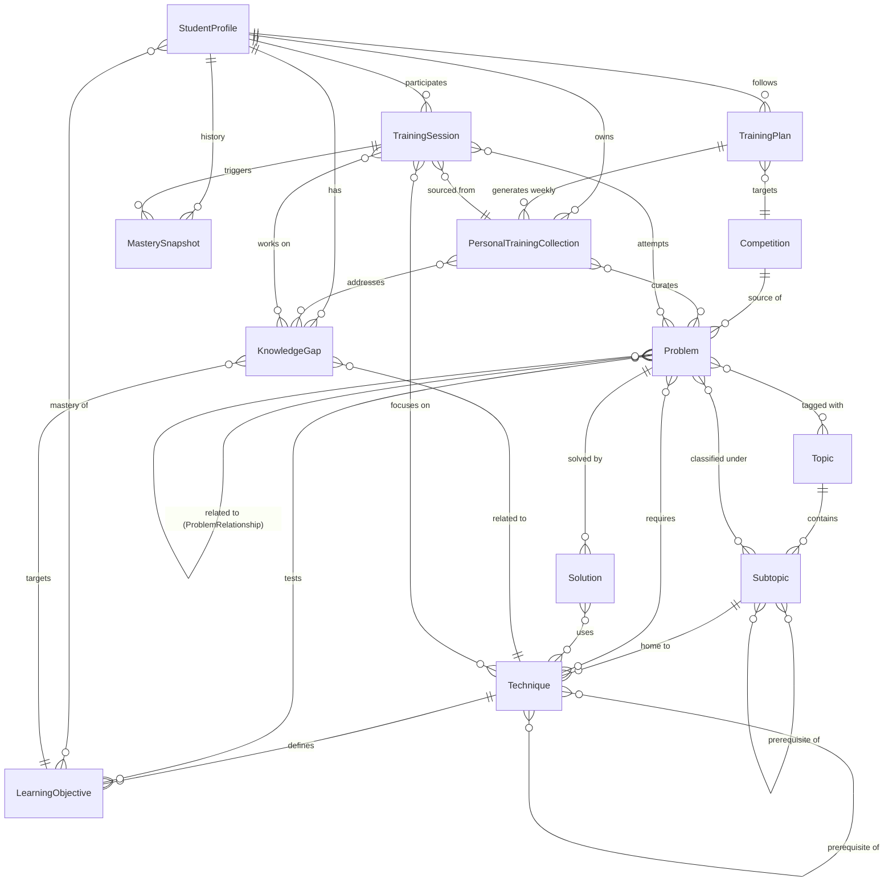

# MathPilot — Domain Model

> AI-powered Math Olympiad Training Platform

## Design Philosophy

Traditional platforms classify problems with a single "difficulty" number (1–10).
This is **insufficient** for olympiad training because:

- A student strong in algebra but weak in geometry sees the *same* difficulty on both.
- A problem rated "hard" might be trivial to someone who knows the specific technique.
- Difficulty is contextual: it depends on what the student *already knows*.

Instead, MathPilot uses a **multi-dimensional classification** built from
Topics, Subtopics, Techniques, and Learning Objectives. Difficulty emerges from
the *relationship* between a problem's required knowledge and a student's current
profile — it is never a static scalar.

---

## Entity–Relationship Overview

```
┌─────────────┐        ┌──────────┐        ┌───────────┐
│ Competition  │───────▶│ Problem  │◀───────│  Topic    │
└─────────────┘  has    └──────────┘ tagged  └───────────┘
                             │                    │
                      requires│               has │
                             ▼                    ▼
                      ┌────────────┐       ┌───────────┐
                      │ Technique  │       │ Subtopic  │
                      └────────────┘       └───────────┘
                             │
                      unlocks│
                             ▼
                  ┌──────────────────┐
                  │LearningObjective │
                  └──────────────────┘
                             ▲
              mastered_by    │    identifies
          ┌──────────────────┤◀───────────────┐
          ▼                  │                │
   ┌──────────────┐   ┌─────────────┐  ┌──────────────┐
   │StudentProfile│──▶│KnowledgeGap │  │TrainingSession│
   └──────────────┘   └─────────────┘  └──────────────┘
          │                                    │
          │  owns                        contains
          ▼                                    ▼
   ┌─────────────────────────┐          ┌──────────┐
   │PersonalTrainingCollection│─────────▶│ Problem  │
   └─────────────────────────┘  curates └──────────┘
```

---

## Entities

### 1. Topic

**Purpose:** Top-level mathematical domain. Organises the entire problem space into
broad, universally recognised branches.

| Field | Type | Description |
|-------|------|-------------|
| `id` | UUID | Primary key |
| `name` | string | e.g. "Number Theory", "Combinatorics" |
| `code` | string | Short slug — `NT`, `COMB`, `GEO`, `ALG` |
| `description` | text | What this branch of mathematics covers |
| `icon` | string | UI icon identifier |
| `display_order` | int | Canonical ordering for UI |

**Relationships:**
- Has many → **Subtopic**
- Has many ↔ **Problem** (many-to-many via `problem_topics`)

**Examples:**
| code | name |
|------|------|
| `ALG` | Algebraic Structures & Manipulations |
| `NT` | Number Theory & Arithmetic |
| `GEO-S` | Synthetic & Projective Geometry |
| `GEO-A` | Analytic & Transformational Geometry |
| `COMB-E` | Enumerative & Algebraic Combinatorics |
| `COMB-S` | Structural & Extremal Combinatorics |
| `GAME` | Strategies, Algorithms & Games |
| `MISC` | Cross-Domain & Unconventional |

---

### 2. Subtopic

**Purpose:** Second-level classification within a Topic. Gives enough granularity
for targeted practice without exploding into hundreds of micro-categories.

| Field | Type | Description |
|-------|------|-------------|
| `id` | UUID | Primary key |
| `topic_id` | FK → Topic | Parent topic |
| `name` | string | e.g. "Divisibility", "Modular Arithmetic" |
| `code` | string | `NT-DIV`, `NT-MOD` |
| `description` | text | Scope of this subtopic |
| `prerequisite_subtopics` | FK[] → Subtopic | Subtopics that should be learned first |

**Relationships:**
- Belongs to → **Topic**
- Has many ↔ **Problem** (many-to-many via `problem_subtopics`)
- Has many → **Technique** (techniques that live under this subtopic)
- Self-referential → prerequisite graph

**Examples (under Number Theory):**
| code | name |
|------|------|
| `NT-DIV` | Divisibility & GCD |
| `NT-MOD` | Modular Arithmetic |
| `NT-PRM` | Prime Numbers & Factorisation |
| `NT-DIO` | Diophantine Equations |

---

### 3. Technique

**Purpose:** A specific method, theorem, or strategy used to solve problems.
This is the **core axis of classification** — the thing a student must *learn*
and *recognise* to solve a problem. A problem may require multiple techniques,
and the same technique appears across different subtopics.

| Field | Type | Description |
|-------|------|-------------|
| `id` | UUID | Primary key |
| `name` | string | e.g. "Pigeonhole Principle" |
| `code` | string | `COMB-PHP`, `NT-CRT` |
| `description` | text | What the technique is and when to apply it |
| `canonical_statement` | text | Formal theorem statement (LaTeX) |
| `primary_subtopic_id` | FK → Subtopic | Where this technique is most commonly taught |
| `cognitive_load` | enum | `foundational`, `intermediate`, `advanced`, `elite` |
| `prerequisite_techniques` | FK[] → Technique | Techniques that must be understood first |

**`cognitive_load` replaces scalar difficulty at the technique level.**
It measures how conceptually demanding the technique itself is, independent of
any particular problem.

| Level | Meaning | Example |
|-------|---------|---------|
| `foundational` | Core building block, taught early | Parity arguments |
| `intermediate` | Requires combining 2-3 foundational ideas | Chinese Remainder Theorem |
| `advanced` | Non-obvious application or deep theory | Lifting the Exponent Lemma |
| `elite` | Research-adjacent or IMO P3/P6 level | Algebraic number theory tricks |

**Relationships:**
- Belongs to → **Subtopic** (primary)
- Has many ↔ **Problem** (many-to-many via `problem_techniques`)
- Has many → **LearningObjective**
- Self-referential → prerequisite graph

**Examples:**
| code | name | cognitive_load |
|------|------|----------------|
| `COMB-PHP` | Pigeonhole Principle | foundational |
| `NT-CRT` | Chinese Remainder Theorem | intermediate |
| `GEO-INV` | Inversion | advanced |
| `ALG-SOS` | Sum of Squares (SOS) decomposition | advanced |
| `COMB-GEN` | Generating Functions | advanced |
| `NT-LTE` | Lifting the Exponent Lemma (LTE) | elite |

---

### 4. Learning Objective

**Purpose:** A measurable skill statement tied to a Technique. This is what the
AI uses to assess mastery and detect gaps. Each objective is atomic and testable:
either the student can do it or they can't.

| Field | Type | Description |
|-------|------|-------------|
| `id` | UUID | Primary key |
| `technique_id` | FK → Technique | Parent technique |
| `code` | string | `LO-PHP-01` |
| `statement` | text | "Apply PHP to finite sets to prove existence of a duplicate" |
| `bloom_level` | enum | `remember`, `understand`, `apply`, `analyse`, `evaluate`, `create` |
| `assessment_criteria` | text | How we decide the student has mastered this |

**Bloom's taxonomy level** captures the *depth* of understanding required:

| Bloom Level | In Olympiad Context |
|-------------|---------------------|
| `remember` | Recall the theorem statement |
| `understand` | Explain why it works; identify when it applies |
| `apply` | Use it in a standard configuration |
| `analyse` | Decompose a novel problem to find where it fits |
| `evaluate` | Compare alternative approaches, choose this one |
| `create` | Combine with other techniques in a novel proof |

**Relationships:**
- Belongs to → **Technique**
- Has many ↔ **KnowledgeGap** (a gap references unmastered objectives)
- Has many ↔ **StudentProfile** (via mastery records)

**Examples (for Pigeonhole Principle):**
| code | statement | bloom_level |
|------|-----------|-------------|
| `LO-PHP-01` | State the Pigeonhole Principle and its generalised form | remember |
| `LO-PHP-02` | Identify the "pigeons" and "holes" in a word problem | understand |
| `LO-PHP-03` | Apply PHP to prove existence results on finite sets | apply |
| `LO-PHP-04` | Combine PHP with modular arithmetic in multi-step proofs | create |

---

### 5. Problem

**Purpose:** An olympiad problem — the central content unit. Classified along
multiple axes rather than a single difficulty number.

| Field | Type | Description |
|-------|------|-------------|
| `id` | UUID | Primary key |
| `title` | string | Short descriptive title |
| `statement` | text | Full problem text (LaTeX) |
| `source_competition_id` | FK → Competition | Where it appeared |
| `source_year` | int | Year of competition |
| `source_round` | string | "P3", "Shortlist C5", etc. |
| `solution_sketch` | text | Reference solution outline |
| `estimated_solve_time_minutes` | int | Typical time for a prepared student |
| `elegance_rating` | float | Community/editorial rating of beauty |
| `status` | enum | `draft`, `in_review`, `published`, `archived` |
| `ingestion_source` | enum | `pdf_upload`, `manual_entry`, `api_import`, `community` |
| `source_document_url` | string | Original PDF or URL the problem was extracted from |
| `language` | string | Original language (e.g. `es`, `en`, `zh`) |
| `statement_embedding` | vector | Semantic embedding for AI Search (generated, not user-set) |
| `created_at` | timestamp | When added to the platform |
| `reviewed_at` | timestamp | When a human verified classification |
| `reviewed_by` | FK → User | Who reviewed it |

**Multi-dimensional classification (via join tables):**

| Join Table | Links To | Meaning |
|------------|----------|---------|
| `problem_topics` | Topic | Broad area(s) the problem covers |
| `problem_subtopics` | Subtopic | Specific subtopic(s) |
| `problem_techniques` | Technique + `is_primary` flag | Techniques required to solve it |
| `problem_learning_objectives` | LearningObjective | Which LOs this problem tests |

**Additional classification fields on the Problem itself:**

| Field | Type | Description |
|-------|------|-------------|
| `competition_level` | enum | `local`, `state`, `national`, `international` — which stage of the olympiad pipeline |
| `position_in_paper` | enum | `early`, `middle`, `late` — position within the specific competition paper |
| `proof_style` | enum | `construction`, `existence`, `bound`, `characterisation`, `computation` |
| `creativity_demand` | enum | `low`, `medium`, `high`, `extreme` |
| `multi_technique_depth` | int | How many distinct techniques are combined (1–5+) |

**Why no single `difficulty` field?**

Difficulty is not a static property of the problem — it depends on *who is solving it*.
A problem classified as `competition_level: national` may be trivial to an IMO
medallist but impenetrable to a state-level student. The `competition_level` tells
you where the problem sits in the olympiad pipeline (local → state → national →
international), while the system computes **personalised difficulty** at query time:

```
personalised_difficulty(problem, student) =
    f(problem.required_techniques,
      student.mastery_levels,
      problem.multi_technique_depth,
      problem.creativity_demand)
```

**Relationships:**
- Belongs to → **Competition** (source)
- Has many → **Solution** (multiple solution approaches)
- Has many ↔ **Topic**, **Subtopic**, **Technique**, **LearningObjective**
- Has many ↔ **Problem** (via **ProblemRelationship** — similar, easier/harder variants)
- Appears in many → **PersonalTrainingCollection**
- Attempted in many → **TrainingSession**

**Problem lifecycle:**

```
  pdf_upload / manual_entry / api_import
              │
              ▼
          ┌────────┐     AI classifies      ┌───────────┐     human verifies     ┌───────────┐
          │  draft  │ ──────────────────────▶│ in_review │ ──────────────────────▶│ published │
          └────────┘                         └───────────┘                        └───────────┘
                                                                                       │
                                                                                 soft-delete
                                                                                       ▼
                                                                                 ┌──────────┐
                                                                                 │ archived │
                                                                                 └──────────┘
```

**Example:**

```
Problem:
  title: "Coloured Points on a Circle"
  source: IMO 2023 Shortlist, C4
  status: published
  competition_level: international
  position_in_paper: middle
  proof_style: existence
  creativity_demand: high
  multi_technique_depth: 2
  topics: [Combinatorics]
  subtopics: [Extremal Combinatorics, Graph Colouring]
  techniques: [Pigeonhole Principle (primary), Double Counting]
  learning_objectives: [LO-PHP-04, LO-DC-02]
```

---

### 5b. Solution

**Purpose:** A distinct solution approach to a Problem. Extracted from
`detailed_solutions` (which was a json[] blob) into a first-class entity so that
solutions can be individually searched, rated, linked to specific techniques, and
used by the AI to generate targeted hints.

**Why this is needed:** A problem often has 2–4 valid solution approaches, each
using different techniques. When the AI recommends a problem to reinforce `T-INV`
(inversion), it needs to know *which solution* uses inversion — not just that
the problem "requires" it. It also enables the AI to say "you solved it with
Cauchy-Schwarz — now try the generating functions approach."

| Field | Type | Description |
|-------|------|-------------|
| `id` | UUID | Primary key |
| `problem_id` | FK → Problem | Parent problem |
| `approach_name` | string | e.g. "Via inversion", "Generating functions approach" |
| `body` | text | Full solution text (LaTeX) |
| `techniques_used` | FK[] → Technique | Which techniques this specific approach uses |
| `elegance_rating` | float | How elegant this particular approach is |
| `is_canonical` | bool | Is this the "standard" or most instructive solution? |
| `author` | string | Who wrote this solution (attribution) |
| `created_at` | timestamp | |

**Relationships:**
- Belongs to → **Problem**
- Has many ↔ **Technique** (techniques used in *this* approach)

**Impact on existing model:**
- Removes `detailed_solutions` json[] from Problem (replaced by this entity)
- Enables technique-specific search: "find problems with a solution using inversion"
- The `problem_techniques` join table now represents the *union* of techniques
  across all solutions; each Solution carries its own technique list

**Example:**
```
Problem: ISL-2019-C3
  Solution 1:
    approach_name: "Direct PHP on residues"
    techniques_used: [T-PHP, T-CONGBASIC]
    is_canonical: true
  Solution 2:
    approach_name: "Generating functions"
    techniques_used: [T-OGF, T-BINOMEXP]
    is_canonical: false
```

---

### 5c. Problem Relationship

**Purpose:** Expresses connections between problems — similarity, prerequisite
ordering, alternative formulations, or difficulty variants. This is the backbone
of "if you liked this problem, try this one" recommendations and "try the easier
version first" scaffolding.

**Why this is needed:** The current model has no way to say "Problem A is a simpler
version of Problem B" or "these two problems are essentially the same idea in
different clothing." Without this, recommendations are purely technique-based and
miss the pedagogical structure that experienced coaches use.

| Field | Type | Description |
|-------|------|-------------|
| `id` | UUID | Primary key |
| `problem_a_id` | FK → Problem | First problem |
| `problem_b_id` | FK → Problem | Second problem |
| `relationship_type` | enum | `similar`, `easier_variant`, `harder_variant`, `prerequisite`, `dual`, `generalisation` |
| `strength` | float | How strong the relationship is (0–1) |
| `explanation` | text | Why these problems are related |
| `detected_by` | enum | `ai_embedding`, `ai_classification`, `human_coach`, `community` |
| `created_at` | timestamp | |

**Relationship types:**
| Type | Meaning | Directionality |
|------|---------|----------------|
| `similar` | Same techniques, similar structure | Symmetric |
| `easier_variant` | A is an easier version of B | A → B (directed) |
| `harder_variant` | A is a harder version of B | A → B (directed) |
| `prerequisite` | Solve A before attempting B | A → B (directed) |
| `dual` | Same problem restated (different competition, same idea) | Symmetric |
| `generalisation` | B generalises A | A → B (directed) |

**Relationships:**
- Links two → **Problem** entities
- Used by recommendation engine and training plan generator

**Impact on existing model:**
- Enriches recommendations beyond technique matching
- Enables "problem ladders" — sequences of increasing difficulty on the same idea
- AI can auto-detect similarity via `statement_embedding` cosine similarity

---

### 6. Competition

**Purpose:** Represents a specific maths competition or competition series.
Used for provenance, filtering, and calibrating problem expectations.

| Field | Type | Description |
|-------|------|-------------|
| `id` | UUID | Primary key |
| `name` | string | "International Mathematical Olympiad" |
| `abbreviation` | string | "IMO" |
| `country` | string | Country or "International" |
| `level` | enum | `school`, `regional`, `national`, `international` |
| `typical_position_count` | int | Number of problems per paper (e.g. 6 for IMO) |
| `description` | text | Background, format, history |
| `website_url` | string | Official site |
| `is_active` | bool | Still running? |

**Relationships:**
- Has many → **Problem**

**Examples:**
| abbreviation | name | level |
|-------------|------|-------|
| `IMO` | International Mathematical Olympiad | international |
| `USAMO` | USA Mathematical Olympiad | national |
| `EGMO` | European Girls' Mathematical Olympiad | international |
| `AMC12` | American Mathematics Competition 12 | school |
| `ISL` | IMO Shortlist | international |

---

### 7. Student Profile

**Purpose:** Represents a learner. Stores mastery state across all learning
objectives and aggregated topic-level proficiency.

| Field | Type | Description |
|-------|------|-------------|
| `id` | UUID | Primary key |
| `user_id` | FK → User | Authentication identity |
| `display_name` | string | Name shown in UI |
| `target_competition_id` | FK → Competition | What they are training for |
| `target_year` | int | Competition year |
| `training_start_date` | date | When they started on the platform |
| `weekly_hours_budget` | float | Available training hours per week |
| `preferred_topics` | FK[] → Topic | Topics they enjoy (for motivation) |

**Mastery tracking (separate table `student_mastery`):**

| Field | Type | Description |
|-------|------|-------------|
| `student_id` | FK → StudentProfile | |
| `learning_objective_id` | FK → LearningObjective | |
| `mastery_level` | enum | `not_seen`, `attempted`, `developing`, `proficient`, `mastered` |
| `confidence` | float | AI's confidence in the assessment (0–1) |
| `last_assessed_at` | timestamp | When this was last evaluated |
| `evidence_problem_ids` | FK[] → Problem | Problems that informed this assessment |

**Mastery levels:**
| Level | Meaning |
|-------|---------|
| `not_seen` | Student has never encountered this objective |
| `attempted` | Tried but did not succeed |
| `developing` | Partially correct or solved with heavy hints |
| `proficient` | Solves standard applications independently |
| `mastered` | Applies fluently in novel contexts |

**Relationships:**
- Has many → **KnowledgeGap**
- Has many → **PersonalTrainingCollection**
- Has many → **TrainingSession**
- Has many → **TrainingPlan**
- Has many ↔ **LearningObjective** (via `student_mastery`)
- Has many → **MasterySnapshot** (historical progression)

---

### 7b. Mastery Snapshot (History)

**Purpose:** Records a point-in-time snapshot of a student's mastery state.
The `student_mastery` table only stores the *current* state — this entity captures
how mastery evolved over time, enabling progress visualisation, regression
detection, and "you've improved X% this month" reporting.

**Why this is needed:** Without history, the system can't answer "how much did
Maria improve this week?" or "is she regressing on geometry?". Coaches need trend
data, not just current state. The AI also needs history to detect patterns like
"mastery goes up during sessions but decays between them" (indicating a spaced
repetition issue).

| Field | Type | Description |
|-------|------|-------------|
| `id` | UUID | Primary key |
| `student_id` | FK → StudentProfile | |
| `snapshot_type` | enum | `session_end`, `weekly`, `plan_milestone`, `manual` |
| `captured_at` | timestamp | When this snapshot was taken |
| `trigger_session_id` | FK → TrainingSession | Session that triggered this snapshot (if session_end) |
| `mastery_data` | json | Full mastery state: `{ "LO-PHP-01": { "level": "proficient", "confidence": 0.85 }, ... }` |
| `summary_stats` | json | Aggregated stats: `{ "total_mastered": 42, "total_developing": 15, "by_domain": {...} }` |

**Relationships:**
- Belongs to → **StudentProfile**
- Optionally triggered by → **TrainingSession**

**Impact on existing model:**
- `student_mastery` remains the live/current table (fast reads for recommendations)
- `MasterySnapshot` is append-only (never updated, only inserted)
- Together they give current state + full history without slowing down the hot path

**Example:**
```
MasterySnapshot:
  student: "Maria"
  snapshot_type: session_end
  captured_at: 2026-03-15T18:30:00Z
  trigger_session_id: session-abc-123
  summary_stats:
    total_mastered: 42
    total_proficient: 28
    total_developing: 15
    by_domain:
      ALG: { mastered: 12, proficient: 8 }
      NT: { mastered: 10, proficient: 6 }
      GEO-S: { mastered: 5, proficient: 3 }
      ...
```

---

### 8. Knowledge Gap

**Purpose:** An AI-identified weakness in a student's profile. Gaps drive
recommendations and training-path generation. They are living entities — created,
prioritised, and eventually closed as the student progresses.

| Field | Type | Description |
|-------|------|-------------|
| `id` | UUID | Primary key |
| `student_id` | FK → StudentProfile | Who has this gap |
| `learning_objective_id` | FK → LearningObjective | What they're missing |
| `technique_id` | FK → Technique | Parent technique (denormalised for queries) |
| `severity` | enum | `minor`, `moderate`, `major`, `critical` |
| `detected_at` | timestamp | When the AI identified this gap |
| `resolved_at` | timestamp | Null until closed |
| `detection_method` | enum | `diagnostic_test`, `session_analysis`, `self_report`, `pattern_inference` |
| `priority_score` | float | Computed: how urgently to address this gap |
| `blocking_objectives` | FK[] → LearningObjective | What this gap prevents the student from learning |
| `recommended_problems` | FK[] → Problem | AI-suggested problems to close the gap |

**Severity model:**
| Severity | Meaning |
|----------|---------|
| `minor` | Nice to know; not blocking progress |
| `moderate` | Occasionally causes failure on relevant problems |
| `major` | Frequently causes failure; blocks a subtopic |
| `critical` | Foundational gap; blocks multiple downstream techniques |

**Priority score formula:**

```
priority_score =
    severity_weight
  × downstream_impact(blocking_objectives)
  × competition_relevance(target_competition)
  × recency_decay(detected_at)
```

**Relationships:**
- Belongs to → **StudentProfile**
- References → **LearningObjective**, **Technique**
- Addressed by → **TrainingSession**

**Example:**

```
KnowledgeGap:
  student: "Maria"
  learning_objective: LO-PHP-04 (Combine PHP with modular arithmetic)
  severity: major
  detection_method: session_analysis
  priority_score: 0.87
  blocking_objectives: [LO-EXT-02 (Extremal principle with PHP)]
  recommended_problems: [ISL-2019-C3, USAMO-2021-P1]
```

---

### 9. Personal Training Collection

**Purpose:** A curated set of problems, either AI-generated or student-created.
Serves as problem sets, worksheets, bookmarks, or revision packs. Replaces the
traditional "problem set" with a flexible, taggable container.

| Field | Type | Description |
|-------|------|-------------|
| `id` | UUID | Primary key |
| `student_id` | FK → StudentProfile | Owner |
| `title` | string | e.g. "IMO 2025 Geometry Prep" |
| `description` | text | Purpose of this collection |
| `collection_type` | enum | `ai_generated`, `manual`, `diagnostic`, `revision`, `competition_sim` |
| `target_gaps` | FK[] → KnowledgeGap | Gaps this collection aims to address |
| `created_at` | timestamp | |
| `is_archived` | bool | Soft-archive completed collections |

**Collection items (separate table `collection_items`):**

| Field | Type | Description |
|-------|------|-------------|
| `collection_id` | FK → PersonalTrainingCollection | |
| `problem_id` | FK → Problem | |
| `position` | int | Order in the collection |
| `status` | enum | `pending`, `attempted`, `solved`, `skipped`, `review` |
| `notes` | text | Student's personal notes on this problem |
| `added_by` | enum | `ai`, `student`, `coach` |

**Relationships:**
- Belongs to → **StudentProfile**
- Has many ↔ **Problem** (via `collection_items`)
- References → **KnowledgeGap** (targeted gaps)
- Fed into → **TrainingSession**

---

### 10. Training Session

**Purpose:** A single study session where a student works on problems. Captures
attempt data, AI-generated hints, time tracking, and feeds back into the mastery
model. This is the **feedback loop** entity — without it, the system cannot learn
about the student.

| Field | Type | Description |
|-------|------|-------------|
| `id` | UUID | Primary key |
| `student_id` | FK → StudentProfile | Who trained |
| `collection_id` | FK → PersonalTrainingCollection | Source collection (optional) |
| `started_at` | timestamp | Session start |
| `ended_at` | timestamp | Session end |
| `session_type` | enum | `practice`, `timed_drill`, `diagnostic`, `review`, `competition_sim` |
| `target_duration_minutes` | int | Planned length |
| `actual_duration_minutes` | int | Real length |
| `focus_techniques` | FK[] → Technique | What the session focused on |
| `gaps_addressed` | FK[] → KnowledgeGap | Gaps targeted in this session |

**Problem attempts (separate table `session_attempts`):**

| Field | Type | Description |
|-------|------|-------------|
| `id` | UUID | Primary key |
| `session_id` | FK → TrainingSession | |
| `problem_id` | FK → Problem | |
| `started_at` | timestamp | When the student began this problem |
| `time_spent_minutes` | int | Total time |
| `result` | enum | `solved`, `partial`, `stuck`, `skipped` |
| `score` | float | 0–7 (IMO-style) or 0–1 normalised |
| `hints_used` | int | Number of AI hints requested |
| `hint_log` | json | What hints were given and when |
| `student_solution` | text | Student's submitted work (LaTeX) |
| `ai_feedback` | text | AI-generated feedback on the attempt |
| `mastery_updates` | json | Which LO mastery levels changed as a result |

**Relationships:**
- Belongs to → **StudentProfile**
- Optionally belongs to → **PersonalTrainingCollection**
- Has many → **session_attempts** (→ **Problem**)
- Updates → **student_mastery** (on StudentProfile)
- May resolve → **KnowledgeGap**

**Example session:**

```
TrainingSession:
  student: "Maria"
  session_type: practice
  focus_techniques: [Pigeonhole Principle, Double Counting]
  duration: 90 minutes

  attempts:
    - problem: ISL-2019-C3
      result: partial (4/7)
      hints_used: 1
      time: 35 min
      → mastery update: LO-PHP-03 developing→proficient

    - problem: USAMO-2021-P1
      result: stuck
      hints_used: 3
      time: 40 min
      → knowledge gap LO-PHP-04 confirmed, severity raised to critical

    - problem: RMM-2020-P2
      result: solved (7/7)
      hints_used: 0
      time: 15 min
      → mastery update: LO-DC-01 proficient→mastered
```

---

### 11. Training Plan

**Purpose:** A multi-week structured plan that sequences techniques and problems
to close knowledge gaps and prepare for a target competition. Different from
PersonalTrainingCollection (which is a flat problem set): a TrainingPlan has
**temporal structure**, **milestones**, and **adaptive replanning**.

**Why this is needed:** The taxonomy document describes a training plan generation
algorithm, but the domain model had no entity to store the result. Without this,
the AI generates plans that vanish — they can't be tracked, adapted, or compared
to actual progress. Coaches also need to see and override plans.

| Field | Type | Description |
|-------|------|-------------|
| `id` | UUID | Primary key |
| `student_id` | FK → StudentProfile | Who this plan is for |
| `title` | string | e.g. "USAMO 2027 — 12 Week Prep" |
| `target_competition_id` | FK → Competition | What they're training for |
| `start_date` | date | When the plan begins |
| `end_date` | date | Target end date |
| `total_weeks` | int | Plan duration |
| `status` | enum | `draft`, `active`, `paused`, `completed`, `abandoned` |
| `generation_method` | enum | `ai_generated`, `coach_created`, `hybrid` |
| `priority_gaps_at_creation` | FK[] → KnowledgeGap | Gaps that drove this plan |
| `created_at` | timestamp | |
| `last_replanned_at` | timestamp | Last time the AI adapted the remaining weeks |

**Plan weeks (separate table `plan_weeks`):**

| Field | Type | Description |
|-------|------|-------------|
| `id` | UUID | Primary key |
| `plan_id` | FK → TrainingPlan | Parent plan |
| `week_number` | int | 1-indexed week |
| `theme` | string | e.g. "LTE prerequisites + Inversion intro" |
| `focus_techniques` | FK[] → Technique | Primary techniques for this week |
| `target_gaps` | FK[] → KnowledgeGap | Gaps this week aims to close |
| `collection_id` | FK → PersonalTrainingCollection | Problem set for this week (auto-generated) |
| `status` | enum | `upcoming`, `in_progress`, `completed`, `skipped`, `replanned` |
| `notes` | text | Coach or AI notes on this week |

**Relationships:**
- Belongs to → **StudentProfile**
- References → **Competition** (target)
- Has many → **plan_weeks** (→ PersonalTrainingCollection, Technique, KnowledgeGap)
- Each plan_week generates a → **PersonalTrainingCollection**
- TrainingSessions feed back into plan evaluation

**Impact on existing model:**
- PersonalTrainingCollection gains an optional `plan_week_id` FK (linking it
  to the plan that generated it)
- TrainingSession can now reference a plan week for context
- KnowledgeGap's `recommended_problems` can be delegated to the plan

**Example:**
```
TrainingPlan:
  student: "Maria"
  title: "USAMO 2027 — 12 Week Prep"
  status: active
  total_weeks: 12

  plan_weeks:
    week 1:
      theme: "Legendre's Formula (prerequisite repair)"
      focus_techniques: [T-LEGENDRE]
      status: completed
    week 2:
      theme: "LTE introduction + Power of a Point reinforcement"
      focus_techniques: [T-LTE, T-POP]
      status: in_progress
    week 3:
      theme: "LTE application + Radical Axis"
      focus_techniques: [T-LTE, T-RADAXIS]
      status: upcoming
    ...
```

---

## Cross-Cutting Relationships Summary



---

## How Difficulty Emerges (Not Stored)

Instead of `problem.difficulty = 7`, the system computes:

```
                    ┌──────────────────────────────┐
                    │   Personalised Difficulty     │
                    │                              │
                    │  = f( required_techniques,   │
                    │       student_mastery,        │
                    │       multi_technique_depth,  │
                    │       creativity_demand,      │
                    │       competition_level )     │
                    └──────────────────────────────┘
                         ▲                ▲
                         │                │
              ┌──────────┘                └──────────┐
              │                                      │
     Problem attributes                   Student Profile
     (static, per-problem)               (dynamic, per-student)
```

**Example:**

| Problem | Maria (strong NT, weak COMB) | Alex (strong COMB, weak GEO) |
|---------|------------------------------|-------------------------------|
| ISL C4 (PHP + Double Counting) | Hard (gaps in both techniques) | Easy (mastered both) |
| IMO P2 (Inversion) | Medium (proficient in GEO) | Hard (developing in GEO) |
| USAMO P1 (Number Theory) | Easy (mastered NT techniques) | Medium (proficient in NT) |

Same problems, different difficulty — driven by the model, not a label.

---

## Key Design Decisions

| Decision | Rationale |
|----------|-----------|
| **No scalar difficulty** | Difficulty is personal; static labels mislead |
| **Technique as primary axis** | What you need to *know* matters more than what *area* it's in |
| **Bloom's on LOs** | Distinguishes "knows the theorem" from "applies it creatively" |
| **Prerequisite graphs** | Enables AI to sequence learning and detect root-cause gaps |
| **KnowledgeGap as first-class entity** | Makes gap-driven recommendations explicit and auditable |
| **Session → mastery feedback loop** | Every attempt updates the model; no stale profiles |
| **Collection as flexible container** | Replaces rigid "problem set" with multi-purpose curation |
| **Solution as first-class entity** | Enables technique-specific search and "try a different approach" coaching |
| **ProblemRelationship graph** | Powers "similar problems", "easier variant", and problem ladders |
| **MasterySnapshot history** | Enables progress tracking, regression detection, and trend reporting |
| **TrainingPlan with weekly structure** | Turns ephemeral AI recommendations into trackable, adaptive plans |
| **Problem lifecycle (draft → published)** | Supports PDF ingestion pipeline with human review before problems go live |
| **Semantic embeddings on Problem** | Enables natural-language search and AI-powered similarity detection |

---

## Search & Retrieval Architecture

The domain model is designed to support **three search modalities** via Azure AI
Search:

### 1. Structured Search (Filters)

Uses the multi-dimensional classification fields directly:

```
Filter: competition_level = 'national'
    AND techniques CONTAINS 'T-PHP'
    AND creativity_demand IN ('insightful', 'inventive')
    AND status = 'published'
```

**Indexed fields:** All enum fields on Problem, plus Topic/Subtopic/Technique
codes from join tables (denormalised into the search index as string arrays).

### 2. Semantic Search (Natural Language)

Uses `statement_embedding` (vector field) for similarity:

```
Query: "problems about colouring integers to avoid arithmetic progressions"
→ Vector similarity search on statement_embedding
→ Returns problems whose statements are semantically close
```

**Embedding source:** Problem statement + solution sketch, embedded via Azure
OpenAI `text-embedding-3-large`.

### 3. Hybrid Search (Chat / Conversational)

Combines structured filters with semantic search, orchestrated by Azure OpenAI:

```
User: "Give me 3 problems that would help Maria practice inversion,
       at national level, that she hasn't seen before"

→ AI decomposes into:
  1. Filter: technique = T-INV, competition_level = national, status = published
  2. Exclude: problems in Maria's session_attempts
  3. Rank by: personalised_difficulty(problem, Maria) ∈ [0.3, 0.6]
  4. Return top 3
```

### Search Index Schema (Azure AI Search)

| Field | Type | Searchable | Filterable | Facetable |
|-------|------|------------|------------|-----------|
| `id` | string | — | ✓ | — |
| `title` | string | ✓ | — | — |
| `statement` | string | ✓ | — | — |
| `statement_embedding` | vector(3072) | ✓ (vector) | — | — |
| `topic_codes` | string[] | — | ✓ | ✓ |
| `subtopic_codes` | string[] | — | ✓ | ✓ |
| `technique_codes` | string[] | — | ✓ | ✓ |
| `competition_level` | string | — | ✓ | ✓ |
| `position_in_paper` | string | — | ✓ | ✓ |
| `proof_style` | string | — | ✓ | ✓ |
| `creativity_demand` | string | — | ✓ | ✓ |
| `competition_abbrev` | string | — | ✓ | ✓ |
| `source_year` | int | — | ✓ | ✓ |
| `status` | string | — | ✓ | — |
