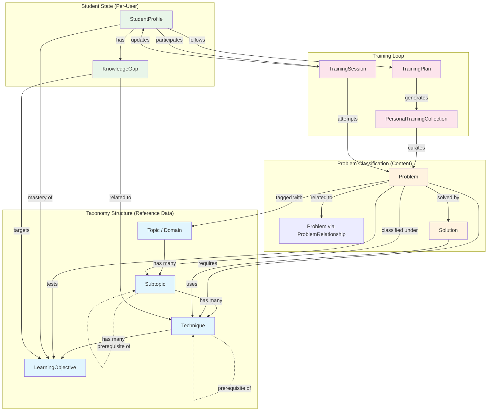

# MathPilot — Taxonomy ↔ Domain Model Integration

> How the 7-layer taxonomy maps to the domain model entities,
> and how taxonomy data flows through each platform feature.

---

## 1. Taxonomy-to-Entity Mapping

The taxonomy defines **classification concepts**. The domain model defines
**data entities**. This section maps each taxonomy layer to the entity that
owns it.

```
┌─────────────────────────────────┐     ┌──────────────────────────────────────┐
│        TAXONOMY (taxonomy.md)   │     │     DOMAIN MODEL (domain-model.md)  │
│                                 │     │                                      │
│  Layer 1: Primary Domains ──────┼────▶│  Topic entity (code, name)           │
│                                 │     │                                      │
│  Layer 2: Subtopics ────────────┼────▶│  Subtopic entity (code, name,        │
│           (3 tiers per domain)  │     │    topic_id, prerequisite_subtopics) │
│                                 │     │                                      │
│  Layer 3: Techniques ───────────┼────▶│  Technique entity (code, name,       │
│           (cognitive_load)      │     │    primary_subtopic_id,              │
│                                 │     │    cognitive_load,                   │
│                                 │     │    prerequisite_techniques)          │
│                                 │     │                                      │
│  Layer 4: Prerequisite Graph ───┼────▶│  Technique.prerequisite_techniques   │
│                                 │     │  Subtopic.prerequisite_subtopics     │
│                                 │     │  (self-referential FK arrays)        │
│                                 │     │                                      │
│  Layer 5: Learning Objectives ──┼────▶│  LearningObjective entity (code,     │
│           (Bloom levels)        │     │    technique_id, bloom_level,        │
│                                 │     │    statement)                        │
│                                 │     │                                      │
│  Layer 6: Complexity Dimensions ┼────▶│  Fields ON the Problem entity:       │
│                                 │     │    competition_level                 │
│                                 │     │    position_in_paper                 │
│                                 │     │    proof_style                       │
│                                 │     │    creativity_demand                 │
│                                 │     │    technique_depth                   │
│                                 │     │    entry_barrier                     │
│                                 │     │                                      │
│  Layer 7: Recommendation Rules ─┼────▶│  NOT stored. Domain logic that reads │
│                                 │     │  from Problem + StudentProfile +     │
│                                 │     │  KnowledgeGap at query time          │
└─────────────────────────────────┘     └──────────────────────────────────────┘
```

### Key Observations

| Taxonomy Layer | Domain Entity | Relationship |
|----------------|---------------|--------------|
| Domains (8) | **Topic** | 1:1 — each domain IS a Topic row |
| Subtopics (58) | **Subtopic** | 1:1 — each subtopic IS a Subtopic row |
| Techniques (160+) | **Technique** | 1:1 — each technique IS a Technique row |
| Tiers (foundational / intermediate / advanced) | **Technique.cognitive_load** + **Subtopic tier grouping** | The tier is encoded in `cognitive_load` on Technique and implicitly in which subtopics exist under a Topic |
| Learning Objectives (500+) | **LearningObjective** | 1:1 — each LO IS a LearningObjective row |
| Complexity Dimensions (6) | **Fields on Problem** | Stored as enum fields directly on the Problem entity |
| Prerequisite DAG | **Self-referential FKs** | `Technique.prerequisite_techniques` and `Subtopic.prerequisite_subtopics` |
| Recommendation rules | **No entity** | Derived at query time from other entities |

---

## 2. Ownership: Which Entity Owns Which Classification?

### Stored Attributes (written once, rarely change)

These live on the entity and are set at creation or ingestion time.

```
Topic
  └── code, name, description                      ← from taxonomy Layer 1

Subtopic
  ├── code, name, description                      ← from taxonomy Layer 2
  ├── topic_id                                     ← which domain it belongs to
  └── prerequisite_subtopics[]                     ← from taxonomy Layer 4

Technique
  ├── code, name, description, canonical_statement ← from taxonomy Layer 3
  ├── primary_subtopic_id                          ← which subtopic it lives under
  ├── cognitive_load                               ← from taxonomy tier (foundational/intermediate/advanced/elite)
  └── prerequisite_techniques[]                    ← from taxonomy Layer 4

LearningObjective
  ├── code, statement, assessment_criteria          ← from taxonomy Layer 5
  ├── technique_id                                 ← which technique it belongs to
  └── bloom_level                                  ← from taxonomy Layer 5

Problem
  ├── competition_level                            ← from taxonomy Layer 6, Dimension 1
  ├── position_in_paper                            ← from taxonomy Layer 6, Dimension 1b
  ├── proof_style                                  ← from taxonomy Layer 6, Dimension 4
  ├── creativity_demand                            ← from taxonomy Layer 6, Dimension 3
  ├── technique_depth                              ← from taxonomy Layer 6, Dimension 2
  ├── entry_barrier                                ← from taxonomy Layer 6, Dimension 5
  └── (via join tables)
      ├── problem_topics[]                         ← which domains
      ├── problem_subtopics[]                      ← which subtopics
      ├── problem_techniques[]                     ← which techniques (with is_primary flag)
      └── problem_learning_objectives[]            ← which LOs this problem tests
```

### Derived Attributes (computed at query time, never stored)

These are calculated from the stored data above. They are **not fields on
any entity** — they are functions.

| Derived Attribute | Inputs | Output | Where Used |
|-------------------|--------|--------|------------|
| `personalised_difficulty(problem, student)` | Problem.techniques, Problem.creativity_demand, Problem.technique_depth, StudentProfile.mastery | float [0, 1] | Recommendations, search ranking |
| `technique_gap(student, technique)` | StudentProfile.mastery for the technique's LOs | float [0, 1] | Gap analysis, plan generation |
| `readiness(student, problem)` | Prerequisite DAG + student mastery | bool | "Is the student ready for this problem?" |
| `competition_level_match(student, problem)` | Student's mastered tier vs problem's competition_level | bool | Filter: "show me problems at my level" |
| `gap_priority_score(gap)` | Gap.severity, downstream_impact, competition_relevance, recency | float | Gap prioritisation |
| `similar_problems(problem)` | ProblemRelationship + shared techniques/subtopics | Problem[] | "More like this" |

---

## 3. Relationship Map: How Taxonomy Connects Entities



**Colour key:**
- 🔵 Blue = Taxonomy reference data (stable, rarely changes)
- 🟠 Orange = Problem content (grows as problems are ingested)
- 🟢 Green = Student state (changes with every session)
- 🔴 Pink = Training loop (operational, session-by-session)

---

## 4. How Taxonomy Supports Each Feature

### 4.1 Problem Search

**Query flow:**

```
User query: "Geometry inversion problems at national level"
         │
         ▼
    ┌─────────────────────────────────────────────┐
    │  Parse into taxonomy terms:                  │
    │    domain  = GEO-A (analytic geometry)       │
    │    technique = T-INV (inversion)             │
    │    competition_level = national              │
    └─────────────────────────────────────────────┘
         │
         ▼
    ┌─────────────────────────────────────────────┐
    │  Query against stored attributes:            │
    │                                              │
    │  SELECT p.* FROM problem p                   │
    │  JOIN problem_techniques pt ON p.id = pt.id  │
    │  JOIN problem_topics ptop ON p.id = ptop.id  │
    │  WHERE pt.technique_code = 'T-INV'           │
    │    AND ptop.topic_code = 'GEO-A'             │
    │    AND p.competition_level = 'national'      │
    │    AND p.status = 'published'                │
    └─────────────────────────────────────────────┘
```

**Taxonomy entities involved:** Topic, Technique, Problem.competition_level

**All stored, no derivation needed.**

### 4.2 Similar Problem Retrieval

**Two mechanisms, both using taxonomy data:**

```
Given: Problem P₁ (requires T-INV + T-RADAXIS, subtopic GEO-A-INV)

Mechanism 1: ProblemRelationship (stored)
  ─── Look up ProblemRelationship rows where problem_a = P₁
  ─── Filter by relationship_type = 'similar'
  ─── Return linked problems

Mechanism 2: Taxonomy overlap (derived)
  ─── Find problems sharing ≥1 technique with P₁
  ─── Score: overlap_score = |shared_techniques| / |union_techniques|
  ─── Boost if same subtopic
  ─── Boost if same competition_level ± 1 step
  ─── Return top N by score
```

**Taxonomy entities involved:** Technique (shared techniques), Subtopic (same area),
Problem.competition_level (similar difficulty band)

**Mechanism 1 is stored. Mechanism 2 is derived at query time.**

### 4.3 Personalised Recommendations

**Data flow:**

```
                    ┌──────────────────┐
                    │  StudentProfile   │
                    │                  │
                    │  mastery per LO: │
                    │   LO-INV-01: proficient  │
                    │   LO-INV-02: developing  │
                    │   LO-PHP-01: mastered    │
                    │   ...                    │
                    └─────────┬────────┘
                              │
         ┌────────────────────┼────────────────────┐
         ▼                    ▼                    ▼
  ┌─────────────┐    ┌──────────────┐    ┌──────────────┐
  │ KnowledgeGap │    │ Target       │    │ Preferred    │
  │ LO-INV-02   │    │ Competition  │    │ Topics       │
  │ severity:    │    │ USAMO        │    │ [GEO-S, NT]  │
  │   major      │    │ (national)   │    │              │
  └──────┬───────┘    └──────┬───────┘    └──────┬───────┘
         │                   │                   │
         └───────────┬───────┘───────────────────┘
                     ▼
         ┌───────────────────────────────────┐
         │  Recommendation Engine (derived)  │
         │                                   │
         │  1. Filter problems by:           │
         │     competition_level ≤ national  │
         │     status = published            │
         │     NOT in student's attempts     │
         │                                   │
         │  2. Score each by:                │
         │     personalised_difficulty()     │
         │     (reads techniques + mastery)  │
         │                                   │
         │  3. Prefer problems that:         │
         │     target active KnowledgeGaps   │
         │     match preferred_topics        │
         │     use technique_depth = single  │
         │     (for gap-closing mode)        │
         │                                   │
         │  4. Return top N                  │
         └───────────────────────────────────┘
```

**Stored data used:**
- Problem: techniques, competition_level, proof_style, creativity_demand
- StudentProfile: mastery per LO, preferred_topics, target_competition
- KnowledgeGap: learning_objective_id, severity

**Derived at query time:**
- personalised_difficulty score
- ranking and filtering

### 4.4 Training Plan Generation

**How the prerequisite DAG drives plan sequencing:**

```
Input:
  Student: Maria
  Target: USAMO (national), 12 weeks
  Active gaps: [T-LTE (critical), T-INV (major), T-EXTREMAL (moderate)]

Step 1: WALK PREREQUISITE DAG BACKWARDS (stored on Technique)
  ──────────────────────────────────────────────────────

  T-LTE requires → T-LEGENDRE requires → T-FLT requires → T-EUCLID
  T-INV requires → T-RADAXIS requires → T-POP requires → T-INSCANG
  T-EXTREMAL requires → T-PHP (no further prereqs)

Step 2: CHECK MASTERY AT EACH NODE (stored on StudentProfile)
  ──────────────────────────────────────────────────────

  T-EUCLID:    mastered ✓ (skip)
  T-FLT:       proficient ✓ (skip)
  T-LEGENDRE:  developing ✗ (schedule!)
  T-LTE:       not_seen ✗ (schedule after T-LEGENDRE)

  T-INSCANG:   mastered ✓ (skip)
  T-POP:       proficient → but target is analyse ✗ (reinforce!)
  T-RADAXIS:   developing ✗ (schedule after T-POP)
  T-INV:       not_seen ✗ (schedule after T-RADAXIS)

  T-PHP:       mastered ✓ (skip)
  T-EXTREMAL:  not_seen ✗ (schedule)

Step 3: TOPOLOGICAL SORT (derived from DAG)
  ──────────────────────────────────────────────────────

  Week order: T-LEGENDRE → T-LTE → T-POP(reinforce) → T-RADAXIS
              → T-INV → T-EXTREMAL → mixed review → mock

Step 4: GENERATE COLLECTIONS (creates PersonalTrainingCollection per week)
  ──────────────────────────────────────────────────────

  Each week's collection filters problems by:
    technique = this week's focus technique
    competition_level ≤ national (Maria's target)
    technique_depth = single (for new techniques)
    creativity_demand = routine → insightful (progression within week)
```

**Stored data used:**
- Technique.prerequisite_techniques (the DAG)
- Technique.cognitive_load (tier validation)
- StudentProfile.mastery (which nodes are gaps)
- Problem classification fields (for collection generation)

**Derived:**
- Topological sort order
- Week assignments
- Problem selection within each week

### 4.5 Gap Analysis

**How a training session feeds back into the taxonomy:**

```
TrainingSession completed
         │
         ▼
    ┌──────────────────────────────────────┐
    │  For each session_attempt:            │
    │                                      │
    │  1. Look up Problem.techniques       │   ← stored on Problem
    │  2. Look up each Technique's LOs     │   ← stored on LearningObjective
    │  3. Evaluate attempt result:         │
    │                                      │
    │     solved (7/7, no hints)?          │
    │       → LO mastery: proficient+     │   ← update StudentProfile.mastery
    │                                      │
    │     partial (hints used)?            │
    │       → LO mastery: developing      │   ← update StudentProfile.mastery
    │                                      │
    │     stuck?                           │
    │       → Check: which technique's LO  │
    │         was the blocker?             │
    │       → Walk prerequisite DAG:       │   ← Technique.prerequisite_techniques
    │         Is the gap HERE or in a      │
    │         prerequisite?                │
    │       → Create/update KnowledgeGap  │   ← targets the root-cause LO
    │                                      │
    │  4. Compute gap severity:            │
    │     How many downstream techniques   │   ← count DAG descendants
    │     does this gap block?             │
    │       many → critical                │
    │       few → moderate                 │
    │       none → minor                   │
    └──────────────────────────────────────┘
```

**Stored data used:**
- Problem → Technique (join table)
- Technique → LearningObjective
- Technique.prerequisite_techniques (root-cause detection)
- StudentProfile.mastery (current state)

**Derived:**
- Whether the gap is in the attempted technique or a prerequisite
- Severity based on downstream impact count

---

## 5. Complexity Dimension Alignment (Verified)

All 6 taxonomy complexity dimensions are present on the Problem entity in
`domain-model.md`. The following table confirms alignment:

| Taxonomy Dimension | Domain Model Field | Type | Status |
|--------------------|--------------------|------|--------|
| Competition Level | `competition_level` | enum: `local`, `state`, `national`, `international` | ✅ Aligned |
| Position in Paper | `position_in_paper` | enum: `early`, `middle`, `late` | ✅ Aligned |
| Technique Depth | `technique_depth` | enum: `single`, `compound`, `synthesis` | ✅ Aligned |
| Creativity Demand | `creativity_demand` | enum: `routine`, `insightful`, `inventive`, `breakthrough` | ✅ Aligned |
| Proof Style | `proof_style` | enum: `computation`, `existence`, `construction`, `bound`, `characterisation`, `impossibility` | ✅ Aligned |
| Entry Barrier | `entry_barrier` | enum: `transparent`, `camouflaged`, `deceptive` | ✅ Aligned |

**Note on estimated solve time:** The Problem entity stores `estimated_solve_time_minutes`
as an integer (continuous value in minutes). The taxonomy defines a coarser enum
(`quick` / `standard` / `extended` / `marathon`). The int representation is kept on
the entity because it is more precise; the enum categories from the taxonomy can be
derived from the int value at query time using range thresholds.

---

## 6. Summary: Stored vs. Derived

```
┌──────────────────────────────────────────────────────────────────┐
│                        STORED (on entities)                      │
│                                                                  │
│  Taxonomy structure:  Topic, Subtopic, Technique, LO             │
│  Prerequisite graph:  Technique → Technique, Subtopic → Subtopic │
│  Problem tags:        problem_topics, problem_subtopics,         │
│                       problem_techniques, problem_LOs            │
│  Complexity dims:     competition_level, proof_style,            │
│                       creativity_demand, technique_depth,        │
│                       entry_barrier, position_in_paper           │
│  Student mastery:     mastery_level per LO                       │
│  Knowledge gaps:      which LO, severity, blocking_objectives    │
│  Problem relations:   ProblemRelationship (similar, variant, etc)│
│  Solution techniques: Solution → Technique[]                     │
└──────────────────────────────────────────────────────────────────┘

┌──────────────────────────────────────────────────────────────────┐
│                    DERIVED (computed at query time)               │
│                                                                  │
│  personalised_difficulty(problem, student)                       │
│  readiness(student, problem)                                     │
│  technique_gap(student, technique)                               │
│  gap_priority_score(gap)                                         │
│  similar_problems(problem) via taxonomy overlap                  │
│  training_plan_sequence(student, gaps) via topological sort      │
│  competition_level_match(student, problem)                       │
└──────────────────────────────────────────────────────────────────┘
```

**Rule of thumb:** If it describes *what something IS*, it's stored. If it describes
*how something relates to a specific student*, it's derived.
